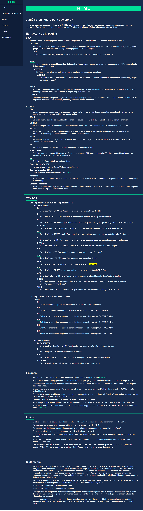

<h1 align='center'>🌟 Proyecto final N°3 del curso Responsive Web Design de FreeCodeCamp 🌟</h1>

> Este proyecto es 3/5 para la certificación del curso. :sparkles:

## Página de documentación técnica sobre HTML 📄
🎯 Objetivo: Construir una aplicación que sea funcionalmente similar a https://technical-documentation-page.freecodecamp.rocks. No copies este proyecto de demostración.

### Historias de usuario (Descripción) 📋
1. Puedes ver un elemento <code>main</code> con su correspondiente <code>id="main-doc"</code>, el cual abarcará el contenido principal de la página (documentación técnica).
2. Dentro del elemento <code>#main-doc</code>, se pueden ver varios elementos <code>section</code>, cada uno con la clase <code>main-section</code>. Debe haber un mínimo de cinco.
3. El primer elemento dentro de cada <code>.main-section</code> debería ser un elemento <code>header</code>, el cual contendrá texto que describa el tema de esa sección.
4. Cada elemento <code>section</code> con la clase <code>main-section</code> debería tener también un <code>id</code> que corresponda al texto de cada header contenido dentro de él. Cualquier espacio debe ser reemplazado por guiones bajos ( Ejemplo: La sección que contiene el encabezado "JavaScript and Java" debe tener un <code>id="JavaScript_and_Java"</code>).
5. Los elementos <code>.main-section</code> deberán tener al menos diez elementos <code>p</code> en total (no cada uno).
6. Los elementos <code>.main-section</code> deberán tener al menos cinco elementos <code>code</code> en total (no cada uno).
7. Los elementos <code>.main-section</code> deberán tener al menos cinco items <code>li</code> en total (no cada uno).
8. Puedes ver un elemento <code>nav</code> con su correspondiente <code>id="navbar"</code>.
9. La barra de navegación deberá contener un elemento <code>header</code>, el cual contendrá texto que describa el tema de la documentación técnica.
10. Además, la barra de navegación deberá contener elementos de enlace (<code>a</code>) con la clase <code>nav-link</code>. Debe haber uno para cada elemento con la clase <code>main-section</code>.
11. El elemento <code>header</code> dentro de la <code>#navbar</code> debería ir antes que los elementos (<code>a</code>) de la barra de navegación.
12. Cada elemento con la clase <code>nav-link</code> debería tener texto que corresponda al texto del header de cada section (Ejemplo: Si tienes una sección/encabezado "Hello world", tu barra de navegación debería tener un elemento que contenga el texto "Hello world").
13. Al hacer click en un elemento de tu barra de navegación, la página debería dirigirse a la sección correspondiente del elemento <code>#main-doc</code> (Ejemplo: Si haces click en el elemento .nav-link que contiene el texto "Hello world", la página debería dirigirse al elemento <code>section</code> que tenga ese <code>id</code> y contenga el encabezado correspondiente).
14. En dispositivos de tamaño normal (portátiles, computadoras de escritorio), el elemento con <code>id="navbar"</code> debe mostrarse en el lado izquierdo de la pantalla y siempre ser visible para el usuario.
15. Tu documentación técnica debe usar al menos una media query.

### Pruebas (Pruebas Técnicas a pasar) ✔️🔬 
- 🧪 Debes tener un elemento <code>main</code> con un <code>id</code> de <code>main-doc</code>.
- 🧪 Debes tener al menos cinco elementos <code>section</code> con la clase <code>main-section</code>.
- 🧪 Todos tus elementos <code>.main-section</code> deben ser elementos <code>section</code>.
- 🧪 Debes tener al menos cinco elementos <code>.main-section</code> que sean descendientes de <code>#main-doc</code>.
- 🧪 El primer hijo de cada <code>.main-section</code> debe ser un elemento <code>header</code>.
- 🧪 Ninguno de tus elementos <code>header</code> debe estar vacío.
- 🧪 Todos tus elementos <code>.main-section</code> deben tener un <code>id</code>.
- 🧪 Cada <code>.main-section</code> debe tener un <code>id</code> que coincida con el texto de su primer hijo, para tener espacios en el texto de su hijo reemplace los espacios por (_) para los <code>id</code>.
- 🧪 Debes tener al menos 10 elementos <code>p</code> dentro de tus elementos <code>.main-section</code>.
- 🧪 Debes tener al menos cinco elementos <code>code</code> que sean descendientes de los elementos <code>.main-section</code>.
- 🧪 Debes tener al menos cinco elementos <code>li</code> que sean descendientes de los elementos <code>.main-section</code>.
- 🧪 Debes tener un elemento <code>nav</code> con un <code>id</code> de <code>navbar</code>.
- 🧪 Tu <code>#navbar</code> debe tener exactamente un elemento <code>header</code> dentro de él.
- 🧪 Debes tener al menos un elemento <code>a</code> con la clase <code>nav-link</code>.
- 🧪 Todos tus elementos <code>.nav-link</code> deben ser elementos de anclaje (<code>a</code>).
- 🧪 Todos tus elementos <code>.nav-link</code> deben estar en el <code>#navbar</code>.
- 🧪 Debes tener el mismo número de elementos <code>.nav-link</code> y <code>.main-section</code>.
- 🧪 El elemento <code>header</code> en el <code>#navbar</code> debe estar antes que cualquier enlace (<code>a</code>) en el <code>#navbar</code>.
- 🧪 Cada <code>.nav-link</code> debe tener un texto que corresponda con el texto del header de su section relacionado (por ejemplo, si tienes un section/header "Hello world", tu <code>#navbar</code> debe tener un <code>.nav-link</code> que tenga el texto "Hello world").
- 🧪 Cada <code>.nav-link</code> debe tener un atributo <code>href</code> que enlace a su correspondiente <code>.main-section</code> (por ejemplo, si haces clic en un elemento <code>.nav-link</code> que contenga el texto "Hello world", la página navega al elemento <code>section</code> con ese <code>id</code>).
- 🧪 Tu <code>#navbar</code> siempre debe estar en el borde izquierdo de la ventana.
- 🧪 Tu proyecto de documentación técnica debe usar al menos una media query.

  
------------

### Instalación 🛠️💻

Sigue estos pasos para clonar y ejecutar el proyecto localmente:

1. Clona este repositorio en tu máquina local utilizando Git:

    ```bash
    git clone https://github.com/Schugu/ProyectoFinalFreeCodeCamp3.git
    ```

2. Navega al directorio del proyecto:

    ```bash
    cd ProyectoFinalFreeCodeCamp3
    ```

3. Una vez clonado el repositorio en tu máquina local, abre el archivo `index.html` en tu navegador web para ver el proyecto.

4. Si deseas personalizar los estilos de la página, puedes hacerlo modificando el archivo `styles.css`. Este archivo contiene todas las reglas de estilo que se aplican a la página. Abre el archivo `styles.css` en un editor de texto o IDE de tu elección, realiza los cambios que desees y guarda el archivo. Luego, recarga la página en tu navegador para ver los cambios aplicados.

------------

### Capturas de pantalla 📸



